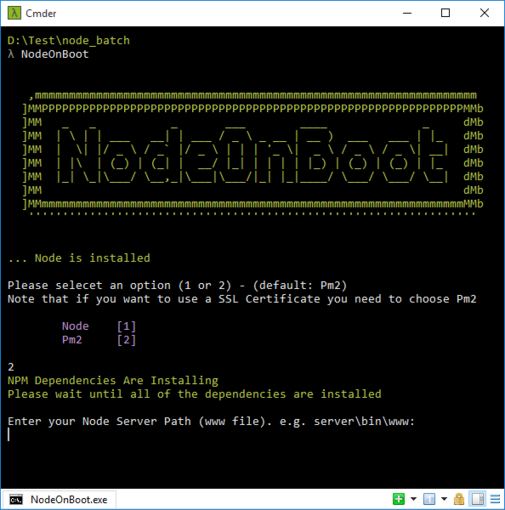

## Functionality
NodeOnBoot is a simple application that autostarts a node.js server after booting on Windows.

## How to use
Compile the project and put the binary file in your porject root, execute it and follow the steps.

## Features
- You have two options of using native Node.js server or pm2.
- It doesn't use NSSM or any other Node.js module to run your server as a Windows Service.
